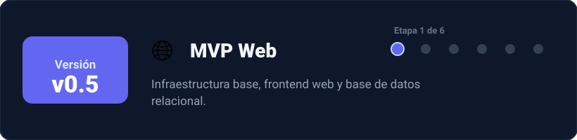
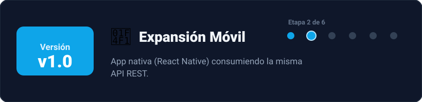
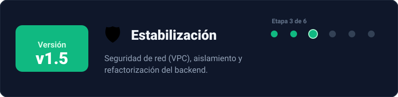
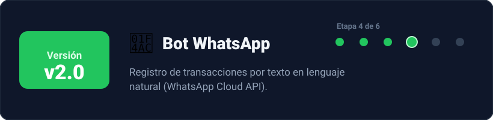
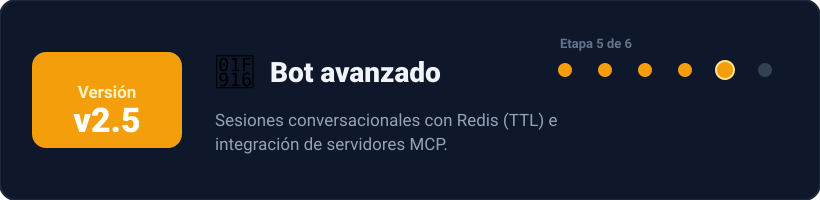
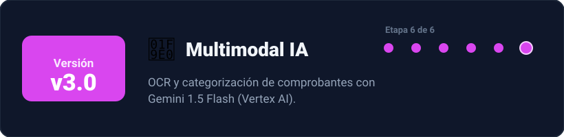
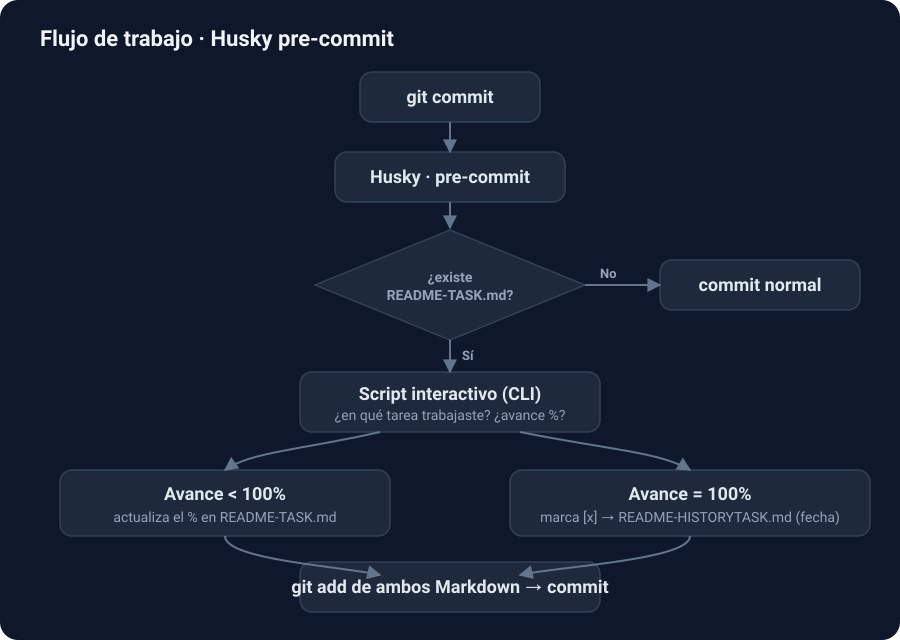
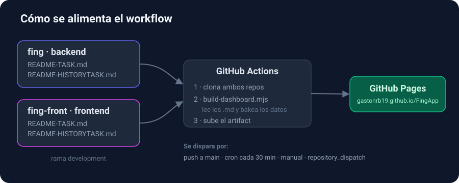

# Fing

Plataforma omnicanal de finanzas personales (web, móvil y conversacional) para registrar y
controlar gastos de forma simple.

🔗 **Dashboard de tareas:** https://gastonrb19.github.io/FingApp/

## Repositorios

- **Backend** — [github.com/gastonrb19/fing](https://github.com/gastonrb19/fing) · Node.js, Express, TypeScript, TypeORM.
- **Frontend** — [github.com/gastonrb19/fing-front](https://github.com/gastonrb19/fing-front) · React, React Native, TypeScript.

## Hoja de ruta

El proyecto avanza de forma incremental en 6 etapas:

## Modo de trabajo

Las tareas se gestionan dentro de cada repo con dos archivos Markdown, sincronizados por un
git hook de **Husky** en cada commit:

- **`README-TASK.md`** — tareas pendientes (`- [ ] Tarea`, con avance opcional `(50%)`).
- **`README-HISTORYTASK.md`** — tareas completadas (`[x]` + fecha).

En cada `git commit`, el hook `pre-commit` ejecuta un script interactivo que pregunta en qué
tarea trabajaste y su porcentaje de avance:

- **< 100%:** actualiza el porcentaje en `README-TASK.md`.
- **100%:** marca la tarea `[x]`, la mueve a `README-HISTORYTASK.md` con la fecha y hace
  `git add` de ambos archivos para dejarlos en el mismo commit.

## Cómo se alimenta el dashboard

El [dashboard](https://gastonrb19.github.io/FingApp/) no lee los repos en vivo: un workflow de
GitHub Actions toma los archivos de tareas de ambos repos y los "hornea" dentro del HTML antes
de publicarlo en GitHub Pages.

1. **Clona** `fing` y `fing-front` (rama `development`) como fuentes de datos.
2. **Lee** sus `README-TASK.md` / `README-HISTORYTASK.md` — los mismos archivos que mantiene el
   flujo de Husky en cada commit.
3. **Bakea** las tareas dentro de `dashboard/template.html` con `scripts/build-dashboard.mjs`
   (parser de Markdown → datos incrustados en el HTML).
4. **Despliega** el `index.html` resultante a **GitHub Pages**.

La fuente de verdad son los Markdown de tareas de cada repo: actualizarlos con Husky y
pushearlos a `development` es lo que alimenta el dashboard en el siguiente deploy (si usas otra
rama, ajusta `BACKEND_REF` / `FRONTEND_REF` en el workflow). El deploy se dispara con cada push
a `main`, de forma programada (cron cada 30 min), manualmente desde *Actions → Run workflow*, o
por `repository_dispatch` desde los repos fuente.
